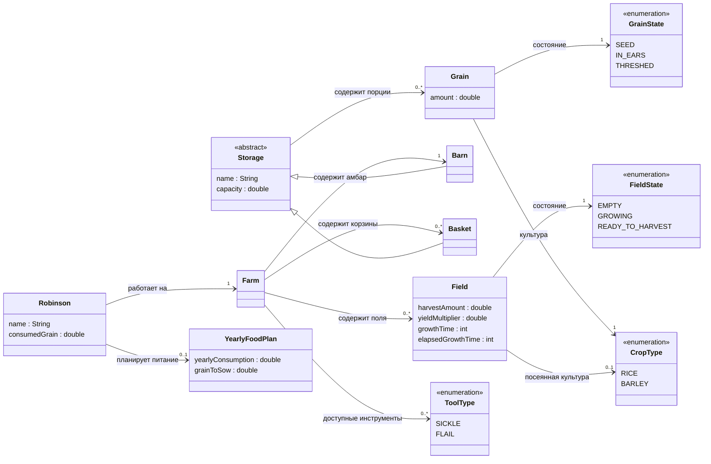

# Объектная модель фермы

UML-модель предметной области Java-проекта: типы объектов, их состояние и связи.

```mermaid
classDiagram
    direction LR

    class Robinson {
        name : String
        consumedGrain : double
    }
    class Farm
    class Field {
        harvestAmount : double
        yieldMultiplier : double
        growthTime : int
        elapsedGrowthTime : int
    }
    class Storage {
        <<abstract>>
        name : String
        capacity : double
    }
    class Barn
    class Basket
    class Grain {
        amount : double
    }
    class YearlyFoodPlan {
        yearlyConsumption : double
        grainToSow : double
    }
    class CropType {
        <<enumeration>>
        RICE
        BARLEY
    }
    class GrainState {
        <<enumeration>>
        SEED
        IN_EARS
        THRESHED
    }
    class FieldState {
        <<enumeration>>
        EMPTY
        GROWING
        READY_TO_HARVEST
    }
    class ToolType {
        <<enumeration>>
        SICKLE
        FLAIL
    }

    Robinson --> "1" Farm : работает на
    Robinson --> "0..1" YearlyFoodPlan : планирует питание
    Farm --> "0..*" Field : содержит поля
    Farm --> "0..*" Basket : содержит корзины
    Farm --> "1" Barn : содержит амбар
    Farm --> "0..*" ToolType : доступные инструменты
    Storage <|-- Barn
    Storage <|-- Basket
    Storage --> "0..*" Grain : содержит порции
    Grain --> "1" CropType : культура
    Grain --> "1" GrainState : состояние
    Field --> "0..1" CropType : посеянная культура
    Field --> "1" FieldState : состояние
```